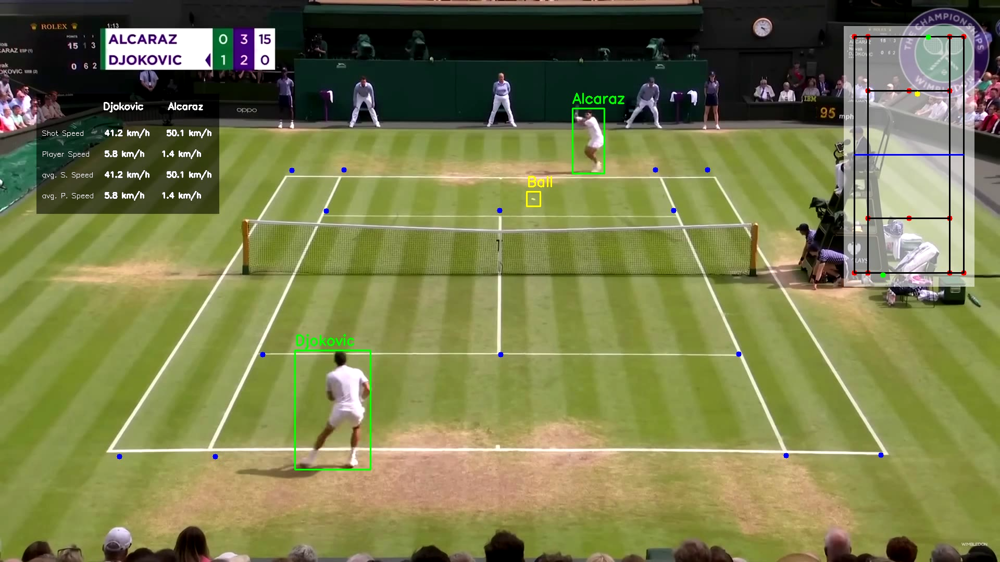

# Tennis Analyzer with YOLOv8, Pytorch and OpenCV

## Tennis Analyzer Using Python, YOLOv8, Pytorch and OpenCV.

It was used YOLOv8, Pytorch and OpenCV to Detect the Court Area, the Players and the Ball.

Using Python, it was able to Calculate Parameters such as the Shoot Speed, Player Speed, Average Player Speed and the Average Shoot Speed.

## Preview

- Tennis Match Preview: https://youtu.be/MVND6gmBA1w?si=HAjBgH5Az0B2SdGj

## Connect
- Linkedin: https://www.linkedin.com/in/luis-jose-mendez/
- GitHub: https://github.com/mendez-luisjose
